full text : https://rpubs.com/sukhyun23/638020

data : https://www.kaggle.com/c/bike-sharing-demand/data
<br>  
<br>  

## 데이터 탐색
데이터 이해를 위한 그림, 기초 통계
<br>  
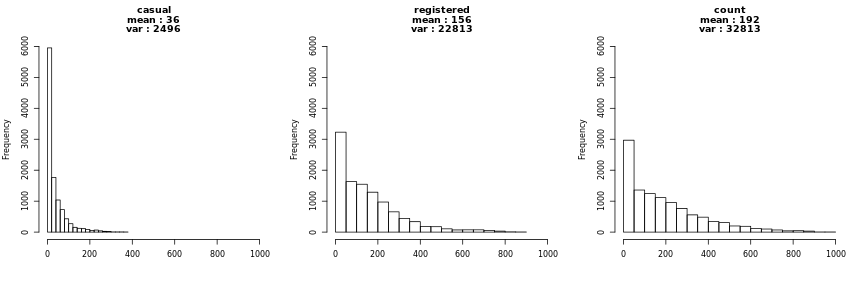
평균과 분산은 큰 차이가 있고 분포가 매우 비대칭적임.
<br>  
<br>  

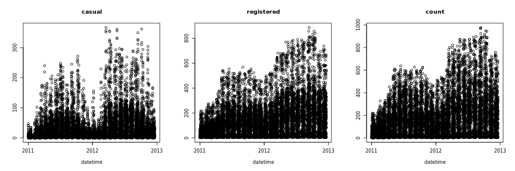
시간의 흐름에 따른 특별한 패턴 확인.
<br>  
<br>  

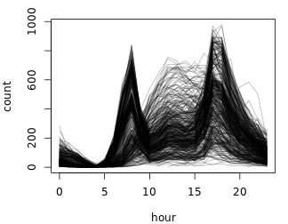
<br>  
일별 특별한 패턴 존재.

<br>  
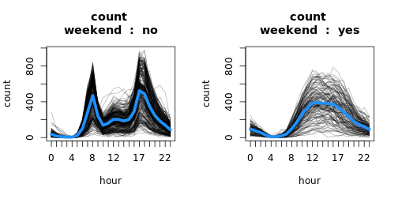
<br>  
주중/주말 범주로 뚜렷하게 구분되는 패턴.
<br>  
<br>  

## count? casual? registered?  
count = casual + registered  
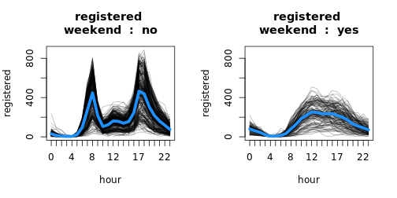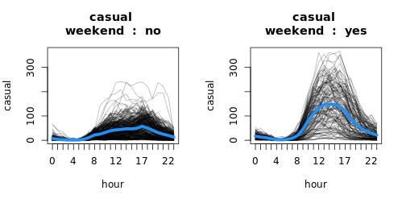
<br>  
casual과 registered의 패턴에 차이 존재함. 출퇴근 시간의 급증은 registered에만 존재.
<br>  
<br>  

## 포아송 모형

```r
model <- count ~ weekend + weather + temp + humidity + windspeed
poi_fit <- glm(formula = model, data = dat_tr, family = poisson)
summary(poi_fit)
```

```
## 
## Call:
## glm(formula = model, family = poisson, data = dat_tr)
## 
## Deviance Residuals: 
##     Min       1Q   Median       3Q      Max  
## -25.193  -10.333   -3.019    4.723   43.102  
## 
## Coefficients:
##                 Estimate Std. Error  z value Pr(>|z|)    
## (Intercept)    5.024e+00  3.869e-03 1298.697  < 2e-16 ***
## weekendyes     5.633e-03  1.534e-03    3.672  0.00024 ***
## weatherbetter  8.411e-02  1.702e-03   49.417  < 2e-16 ***
## weatherworse  -1.616e-01  3.389e-03  -47.681  < 2e-16 ***
## weatherworst   8.341e-01  7.811e-02   10.677  < 2e-16 ***
## temp           4.399e-02  8.961e-05  490.929  < 2e-16 ***
## humidity      -1.327e-02  4.161e-05 -318.839  < 2e-16 ***
## windspeed      3.646e-03  8.880e-05   41.059  < 2e-16 ***
## ---
## Signif. codes:  
## 0 '***' 0.001 '**' 0.01 '*' 0.05 '.' 0.1 ' ' 1
## 
## (Dispersion parameter for poisson family taken to be 1)
## 
##     Null deviance: 1800567  on 10885  degrees of freedom
## Residual deviance: 1358369  on 10878  degrees of freedom
## AIC: 1428031
## 
## Number of Fisher Scoring iterations: 5
```
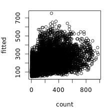
<br>  
시간 패턴 반영 X, 성능 좋지 않음.
<br>  
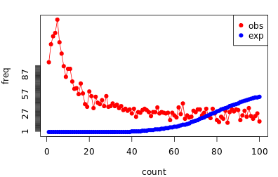
<br>  
가정된 모형과 실제 데이터에 큰 차이.
<br>  
<br>  

```r
# dispersion statistic
pchi2 <- sum(residuals(poi_fit, type = 'pearson')^2)
disp <- pchi2/poi_fit$df.residual
disp
```

```
## [1] 134.9463
```
1을 넘는 dispersion statistic -> overdispersion.
<br>  
<br>  

## GAM 모형 선택 과정 (registered, 주말)

```r
# hour --------------------------------------------------------------------
y <- 'registered' # 'casual', 'registered'
dat_sub <- dat_tr[weekend == 'yes', ] # 'yes', 'no'
dat_sub[, sd := sd(count), by = 'hour']
model <- as.formula(paste(y, ' ~ 1'))
hour_fit <- gam(
  formula = update(model, . ~ s(hour, bs = 'cr', k=14)),
  family = quasipoisson(),
  weights = 1/sd,
  data = dat_sub
)
summary(hour_fit)
```

```
## 
## Family: quasipoisson 
## Link function: log 
## 
## Formula:
## registered ~ s(hour, bs = "cr", k = 14)
## 
## Parametric coefficients:
##             Estimate Std. Error t value Pr(>|t|)    
## (Intercept) 4.447066   0.008852   502.4   <2e-16 ***
## ---
## Signif. codes:  
## 0 '***' 0.001 '**' 0.01 '*' 0.05 '.' 0.1 ' ' 1
## 
## Approximate significance of smooth terms:
##           edf Ref.df    F p-value    
## s(hour) 12.51  12.95 1080  <2e-16 ***
## ---
## Signif. codes:  
## 0 '***' 0.001 '**' 0.01 '*' 0.05 '.' 0.1 ' ' 1
## 
## R-sq.(adj) =  0.709   Deviance explained = 84.9%
## GCV = 0.35808  Scale est. = 0.34808   n = 3163
```

```r
par(mfrow = c(1,1), mar = c(4,4,1.5,1))
plot(
  dat_sub$hour[order(dat_sub$hour)], 
  hour_fit$fitted.values[order(dat_sub$hour)],
  ylab = 'fitted registered', xlab = 'hour',
  type = 'l'
)
```

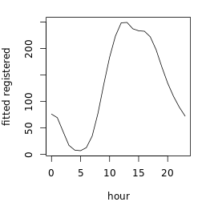

```
## 
## Family: gaussian 
## Link function: identity 
## 
## Formula:
## y_dh ~ s(temp, humidity, k = 15)
## 
## Parametric coefficients:
##             Estimate Std. Error t value Pr(>|t|)
## (Intercept)  0.09288    0.96321   0.096    0.923
## 
## Approximate significance of smooth terms:
##                    edf Ref.df     F p-value    
## s(temp,humidity) 13.88     14 100.1  <2e-16 ***
## ---
## Signif. codes:  
## 0 '***' 0.001 '**' 0.01 '*' 0.05 '.' 0.1 ' ' 1
## 
## R-sq.(adj) =  0.305   Deviance explained = 30.8%
## GCV = 2948.4  Scale est. = 2934.6    n = 3163
```

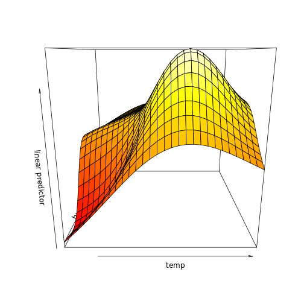
<br>  
<br>  

## 모형과 해석
#### 1) 잔차 진단과 가중치

```r
model <- as.formula(paste(y, ' ~ 1'))
model <- update(
  model, . ~ s(hour, k=14) + 
    s(temp, humidity, k=10) +
    s(temp, windspeed, k=12) + 
    season2 + weather2
)
noweighted <- gam(
  formula = model,
  family = quasipoisson(),
  data = dat_sub
)
weighted <- gam(
  formula = model,
  family = quasipoisson(),
  weights = 1/sd,
  data = dat_sub
)

par(mfrow = c(1,2))
plot(
  noweighted$linear.predictors, resid(noweighted), 
  xlab = 'linear predictors', ylab = 'residual'
)
plot(
  weighted$linear.predictors, resid(weighted),
  xlab = 'linear predictors', ylab = 'residual'
)
```

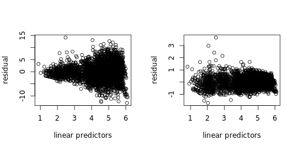
<br>  
<br>  
관측치 등분산성 확인.


```r
regit_end <- readRDS('/home/sukhyun/project/bike_sharing_demand/model/regit_end.rds')
par(mfrow=c(2,2))
gam.check(regit_end)
```

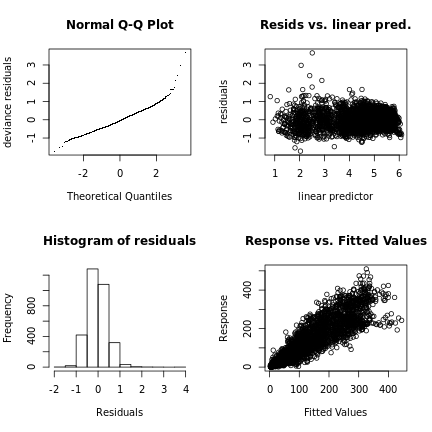

```
## 
## Method: GCV   Optimizer: outer newton
## full convergence after 13 iterations.
## Gradient range [4.214214e-10,2.645693e-07]
## (score 0.20636 & scale 0.2159273).
## Hessian positive definite, eigenvalue range [2.107639e-05,7.771957e-05].
## Model rank =  36 / 36 
## 
## Basis dimension (k) checking results. Low p-value (k-index<1) may
## indicate that k is too low, especially if edf is close to k'.
## 
##                      k'   edf k-index p-value    
## s(hour)           13.00 12.83    0.63  <2e-16 ***
## s(temp,humidity)   9.00  7.45    0.92  <2e-16 ***
## s(temp,windspeed) 10.00  9.43    0.96   0.045 *  
## ---
## Signif. codes:  
## 0 '***' 0.001 '**' 0.01 '*' 0.05 '.' 0.1 ' ' 1
```
<br>  
  
#### 2) 모형 해석

```r
plot(regit_end, pages = 1, all.terms = T)
```

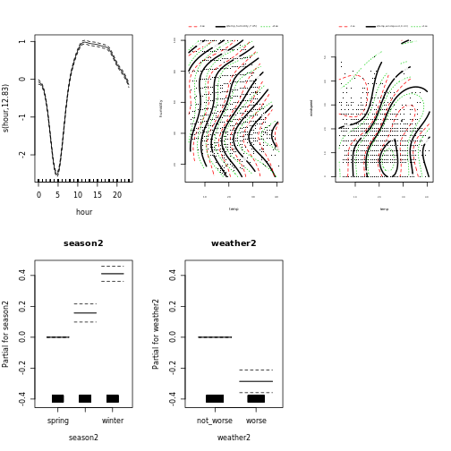
<br>  
<br>  


```r
vis.gam(regit_end, c('temp', 'humidity'), type = 'response')
```

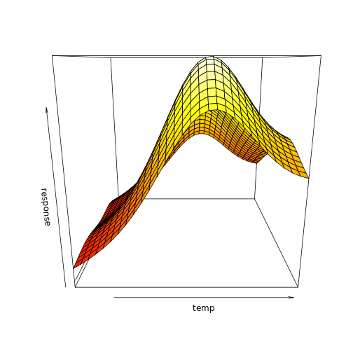
<br>  
<br>    


```r
vis.gam(regit_end, c('temp', 'windspeed'), type = 'response')
```

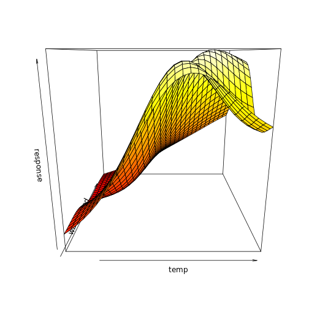
<br>  
<br>  

#### 3) 예측값 시각화

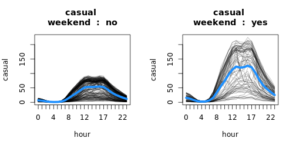
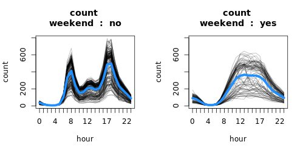
<br>  
<br>  
<br>  

### references

Dobson, Annette J., and Adrian G. Barnett. An introduction to generalized linear models. CRC press, 2018.

Hilbe, Joseph M. Modeling count data. Cambridge University Press, 2014.

Wood, Simon N. Generalized additive models: an introduction with R. CRC press, 2017.

Friedman, Jerome, Trevor Hastie, and Robert Tibshirani. The elements of statistical learning. Vol. 1. No. 10. New York: Springer series in statistics, 2001.

overdispersion에 관한 글 : [link1](https://stats.stackexchange.com/questions/62006/definition-of-dispersion-parameter-for-quasipoisson-family), [link2](https://stats.stackexchange.com/questions/314948/quasi-likelihood-quasi-poisson)
