학습용 문서 입니다.
<br>  

## 데이터 이해 
본격적인 분석에 앞서 데이터 이해를 하기 위해 먼저 어떤 변수들이 있는지 살펴봤다. $y$로 사용될 변수는 자전거 대여 횟수이다. $x$로 사용될 변수는 습도, 온도, 계절등 날씨와 관련있는 변수들이 포함되어 있다. 날씨 변수들로 자전거 대여 횟수를 설명/예측하는것이 이 데이터의 목적일 것이다.  
먼저 $y$는 어떤 변수인지 자세하게 따져볼 필요가 있다. 대여 횟수와 같은 변수는 확률적으로 값이 결정되는 확률 변수라고 봐야 할 것이다. 데이터의 수집 방식은 1시간 단위의 구간내에서 자전거 대여가 일어난 횟수를 집계하여 얻었다. 이런 특성을 보면 $y$는 포아송 분포를 따른다고 가정하고 모델링 해볼 수 있을것이다.  
<br>
<br>

## 포아송 분포
포아송 분포는 확률론에서 단위 시간안에 어떤 사건이 몇 번 발생할 것인지를 표현하는 이산 확률 분포이다.
정해진 시간 안에 어떤 사건이 일어날 횟수에 대한 기대값을 $\lambda$라 했을 때, 그 사건이 $n$회 일어날 확률은 다음과 같다.
<br>  
$f(n;\lambda) = \frac {\lambda^ne^{-\lambda}} {n!}$ $,  \lambda > 0$
<br>  
포아송 분포는 다음과 같은 가정을 만족해야 한다.
<br>  
1. 음이 아닌 정수값을 가진다.  
2. 각 단위 시간은 서로 독립이다.   
3. 2개 이상 사건이 동시에 발생할 확률은 0에 가깝다.  
4. 특정 구간에서 사건이 발상할 확률은 그 구간의 크기에 비례한다.  
5. 평균과 분산은 서로 동일하다.
<br>  
$y$를 포아송 분포라고 할 수 있을까? 포아송 분포의 가정을 일부 만족하지만 그렇지 않은것도 있다. 이 데이터는 평균과 분산은 다르다. 그리고 각 단위 시간이 독립임을 확신할 수 없다. 0~23시 까지의 자전거 대여 횟수는 특별한 패턴대로 움직일 것이고 이것은 각 단위 시간들이 서로 독립이 아님을 의미한다. 포아송 가정을 만족하지 않는 부분 때문에 포아송을 가정하고 모델링하면 아마 문제가 생길것이다. 이를 인지하고 문제점에 대한 해결책을 찾으면서 시도해볼 것이다.
<br>  
<br>  

# 데이터 탐색
모델링 하기에 앞서서 데이터에 대한 이해가 필요하기 때문에 다양한 그림과 기초 통계 수치를 살펴볼 필요가 있다.
<br>  

평균과 분산은 큰 차이가 있고 분포가 매우 비대칭적임을 볼 수 있다.
<br>  
<br>  

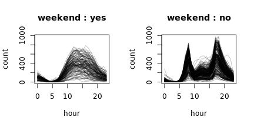
시간의 흐름에 따라 어떤 패턴이 있어 보이지만 비교적 분명하지는 않아 보인다.
자전거 대여점의 특성상 매일 정해진 영업 시간에만 운영 되기 때문에 하루 단위로 보는것이 더 적절할 것이라 판단된다.
<br>  
<br>  

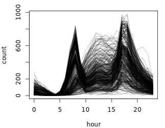
<br>  
위 그림의 개별 선은 1일이고 시간의 흐름에 따른 대여 횟수의 변화를 나타낸다. 하루 단위로 대여 횟수의 변화가 어느정도 눈에 보인다.

<br>  
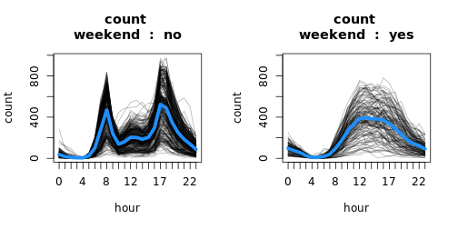
<br>  
다양한 범주형 변수로 구분해서 그려본 결과 이용자 방문 패턴은 주중/주말에 가장 뚜렷하게 차이가 났다.
주중에 6~9, 17~18시 부근에 이용자가 급격히 증가하는 것은 아마도 출퇴근하는 사람으로 추측할 수 있다. 모델링에 이런 차이를 반영하는것이 좋을 것 같다.
<br>  
<br>  

## count? casual? registered?
기존에 회원으로 등록된 사용자들과 그렇지 않은 사용자들에 패턴의 차이가 있다면 이를 모델링에 반영하는것이 모델링 정확도를 높일 수 있을것이다. 기본적으로 $y$로 사용될 변수는 count이고 이는 casual과 registered의 합이다.
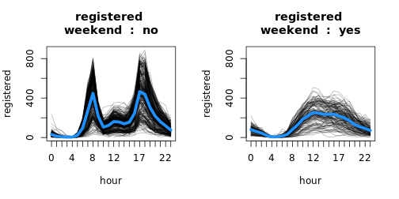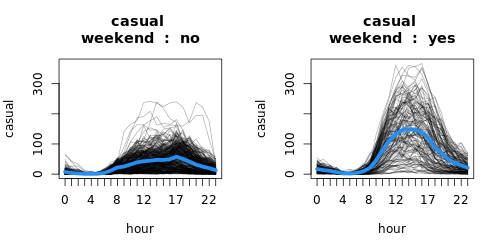
<br>  
casual, registered의 패턴 차이가 있어 보인다. 출퇴근 시간에 이용자가 급증하는 것은 registered 이용자들에게만 나타나는 패턴을 볼 수 있다. casual 이용자들은 그와 같은 패턴이 없고 전반적으로 대여 횟수가 적은것을 확인 할 수 있다.  
몇몇 kaggle 사용자들은 casual, registered 변수를 count를 예측하는 설명변수로 썼는데 이것은 완전 넌센스라고 본다. **casual, registered는 또 다른 $y$이지 $x$가 아니다 (count = registered + casual)**. 참고로 registered와 count의 단순 상관 계수는 0.97이다. 산점도를 그려보면 그 관계가 확실하게 보이고 주중/주말로 나눠 그려보면 그냥 직선이다. 
<br>  
<br>  

## 포아송 모형
간단한 포아송 모형을 적합시켜 보았다.

```r
model <- count ~ weekend + weather + temp + humidity + windspeed
poi_fit <- glm(formula = model, data = dat_tr, family = poisson)
summary(poi_fit)
```

```
## 
## Call:
## glm(formula = model, family = poisson, data = dat_tr)
## 
## Deviance Residuals: 
##     Min       1Q   Median       3Q      Max  
## -25.193  -10.333   -3.019    4.723   43.102  
## 
## Coefficients:
##                 Estimate Std. Error  z value Pr(>|z|)    
## (Intercept)    5.024e+00  3.869e-03 1298.697  < 2e-16 ***
## weekendyes     5.633e-03  1.534e-03    3.672  0.00024 ***
## weatherbetter  8.411e-02  1.702e-03   49.417  < 2e-16 ***
## weatherworse  -1.616e-01  3.389e-03  -47.681  < 2e-16 ***
## weatherworst   8.341e-01  7.811e-02   10.677  < 2e-16 ***
## temp           4.399e-02  8.961e-05  490.929  < 2e-16 ***
## humidity      -1.327e-02  4.161e-05 -318.839  < 2e-16 ***
## windspeed      3.646e-03  8.880e-05   41.059  < 2e-16 ***
## ---
## Signif. codes:  0 '***' 0.001 '**' 0.01 '*' 0.05 '.' 0.1 ' ' 1
## 
## (Dispersion parameter for poisson family taken to be 1)
## 
##     Null deviance: 1800567  on 10885  degrees of freedom
## Residual deviance: 1358369  on 10878  degrees of freedom
## AIC: 1428031
## 
## Number of Fisher Scoring iterations: 5
```
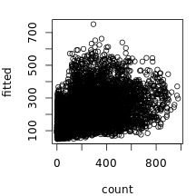
<br>  
계수의 유의성은 있지만 시간의 흐름에 따른 영향을 배제하거나 포함하지 않았기 때문에 이 결과를 신뢰하기 어렵다. 또한 모형의 설명력도 매우 좋지 않다.

<br>  
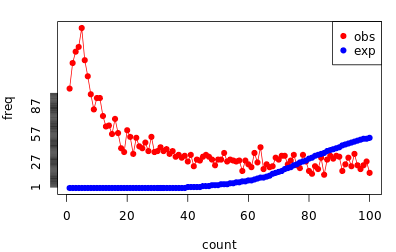
<br>  
obs는 $y_i$의 빈도를 나타낸다. exp는 poisson 모형에서 계산된  $\lambda_i^{\verb!^!}$에 의해 생성된 기대 빈도이다. 모형의 가정과 실제값이 큰 차이가 있음을 확인할 수 있다.
<br>  
<br>  

```r
# dispersion statistic
pchi2 <- sum(residuals(poi_fit, type = 'pearson')^2)
disp <- pchi2/poi_fit$df.residual
disp
```

```
## [1] 134.9463
```
dispersion statistic은 포아송 모형에서 overdispersion을 판단하는 척도로 보통 1을 넘으면 overdispersion, 1보다 작으면 underdispersion이라고 본다. 이 데이터는 1을 훨씬 넘는다.
<br>  
<br>  

## 모형의 문제점
#### 1) 시간 변수 반영
일별 profile 그림을 통해 시간에 따라 특별한 구조를 가지는 경우를 눈으로 볼 수 있었다. 그러나 위 모형에 이 사실은 전혀 반영이 되어 있지 않기 때문에 좋지 못한 결과가 나왔다.  
<br>  

#### 2) overdispersion
overdispersion은 통계 모형에서 기대되는 변동보다 실제 관찰값의 변동이 훨씬 큰 것을 의미한다. 
이 경우 표준오차가 불편성(unbiasedness)을 만족하지 못하게 되고 과소추정 하게 되어 계수 검정을 신뢰할 수 없게 된다. 따라서 유의하게 보일 수 있지만 실제로는 그렇지 않을 수 있다.

* overdispersion이 발생하는 이유
다음은 Hilbe의 Modeling Count Data에서 발췌 하였다.  
<br>  
  - 중요한 설명변수가 생략된 경우  
  - 데이터에 이상치가 있는 경우  
  - 충분한 수의 상호작용항을 포함하는데 실패한 경우  
  - 설명변수에 대한 적절한 변환이 필요한 경우  
  - 데이터가 너무 sparse한 경우  
  - 데이터에 결측치가 존재할때 이것이 랜덤이 아닌 경우(MAR)  
<br>  
  
* GLM에서 Overdispersion을 다루는 방법
<br>  
  - quasi likelihood method  
GLM에서 $y$로 사용되는 변수는 exponential family에 속하는 확률 변수이고 이는 다음과 같은 형태로 쓸 수 있다.
<br>  
 $f_Y(y;\theta,\phi)=exp\{ \frac {y\theta-B(\theta)} {\phi} + C(y,\phi) \}$,  $B(.), C(.)$은 알려진 함수이다.
 <br>  
$\theta$는 canonical parameter, $\phi$는 dispersion parameter라 불린다. 위와 같은 형식의 분포를 가지는 확률 변수 $Y$의 기대값과 분산은 다음과 같다.
<br>  
$\mu=E[Y]=B'(\theta)$  
$Var[Y]=B''(\theta)\phi=V(\mu)\phi$
<br>  
여기서 $V$는 분산 함수이며 exponential family에 대한 분산함수는 $B''(\theta)$이다. dispersion parameter와 분산 함수는 어떤 상수에 대해서만 유일하다.
<br>  
$Poisson(\lambda)$를 따르는 확률 변수 $Y$는 exponential famliy의 형태로 다음과 같이 쓸 수 있다.
<br>  
$f_Y(y) = \frac {\lambda^ye^{-\lambda}} {y!}$  
$\quad\quad\:\:\:=exp\{ylog\lambda-\lambda-logy!\}$  
$\quad\quad\:\:\:=exp\{\frac {ylog\lambda-\lambda} {1} -logy!\}$
<br>  
이 경우 dispersion parameter는 1이다. 만약 dispersion parameter $\phi > 1$ 이면, 조건부 분산이 평균보다 빠르게 증가할 것이다. **quasi poisson은 $\phi$를 1이상의 어떤 값으로 추정한다.**
<br>  
$\phi^{\verb!^!} = \frac {1} {n-k} \Sigma \frac {(Y_i-\mu_i^{\verb!^!})^{2}} {\mu_i^{\verb!^!}}$
<br>  
여기서 $n$은 표본 크기, $k$는 절편 포함 모형에 포함될 변수의 수, ${\mu_i^{\verb!^!}}=g^{-1}(\eta_i^{\verb!^!})$은 fitted 기대값이다.
위 식은 간단하게 $Pearson\ \chi^{2}$을 잔차 자유도로 나눠준 것이다.  
<br>  

  - negative binomial model
<br>  
overdispersion을 다룰 또 한가지 방법으로는 음이항 모형이 있다. 음이항 모형에서 조건부 분산과 평균은 다음과 같은 관계를 가진다.
<br>  
$V(Y_i|\eta_i) = \mu_i + \mu_i^{2}/\phi = \mu_i(1+\mu_i/\phi)$, $\eta_i$는 linear predictor이다.
<br>  
여기서 두 번째 항의 작은 $\phi$가 더 큰 분산을 허용하게 된다. $\phi \rightarrow \infty$이면 분산은 평균에 근접하게 되고 포아송 분포에 가까워지게 된다. quasi poisson과는 대조적으로 조건부 분산이 평균의 2차 함수가 된다.
<br>  
<br>  

## 모형 개선 방안
단순한 포아송 분포를 가정한 모형은 성능도 좋지 않고 이론적으로도 맞지 않는다. 따라서 크게 다음과 같은 2가지 사실이 모형에 반영되어야 한다.
<br>  
1. 시간의 흐름에 따라 바뀌는 특별한 패턴을 모형에 포함시켜야 한다.  
2. 포아송 분포를 가정한다면 overdispersion을 해결해야한다.
<br>  
시간의 패턴은 사실상 알려진 함수라 가정하고 특별한 $f_{hour}(h)$를 모형에 포함할 것이다. scatter plot smoother를 사용하여 이 함수를 찾을것이고 따라서 Generalized Linear Model의 확장인 Generalized Additive Model을 사용할 것이다.
GAM을 사용할 이유는 또 있는데, 이 데이터의 $y$, $x$의 관계를 설명하기에는 선형보다 비선형이 낫다고 생각한다. $x$변수중 온도 변수가 있는데 상식적으로 매우 춥거나 더울때는 사람들이 자전거를 덜 탈것이고 15~20도의 적절한 온도에서는 더 타는 경향이 있을것이다. 즉, 두 변수의 관게는 볼록한 형태를 보일것으로 기대된다. 이 데이터가 현실을 잘 반영하고 있다면 엄격하게 선형으로 설명될리가 없다고 본다. 이런 관계는 다른 연속형 변수들, 습도와 풍속도 마찬가지일 것이다.  
비선형 관계가 나을것이라고 해서 GBM, Random Forest같은 Ensemble 모형이나 Neural Network같은 모형을 고려하지는 않았다 그 정도의 강한 비선형 패턴은 필요 없을것 같고 해석력 있는 모형을 만들어 보고 싶기 때문이다. 
overdispersion은 quasi poisson을 사용하여 더 큰 분산을 허용하는것으로 해결할 것이다. negative binomial은 공부를 덜 했기 때문에 시도하지 않았다.
<br>  
<br>  

## GAM과 GLM
GLM은 3가지 성분으로 구성된다.
<br>  

* Random component : exponential family에 속한 확률 변수.  

* Systematic component : linear predictor라 하는 $\eta =\beta^{'} X$ 추정량과 $X$ᅠ의 선형 결합.  

* Link function : Random component와 Systematic component의 관계를 묘사하는 단조 함수 $g$.
  
이들 세 가지 구성요소에 의하여 GLM은 다음과 같은 구조로 정의할 수 있다.
<br>  
$g(\mu) = \beta^{'} X$
<br>  
$\beta$는 이러한 구조를 만족하는 확률 변수 $Y_i$의 likelihood를 구하는 것으로 시작하여 IRWLS(iterative reweighted least squares)를 수행하는 것으로 계수를 추정한다. GAM은 위에서 서술한 GLM과 구조적으로 동일하며 변수의 smooth function을 포함한다. 실제로 GAM은 기술적으로 smoothing penalty에 종속되어 추정되는 GLM이라 할 수 있다. 

다음은 linear predictor가 포아송 분포를 따르는 log link의 경우 GLM과 GAM의 수식이다.
<br>  
$log(\lambda_i)=\alpha + \beta_1X_1 + \beta_2X_2 + ... \beta_pX_p$  

$log(\lambda_i)=\alpha + f_1(X_1) + f_2(X_2) + ... + f_p(X_p)$
<br>  
비모수 함수 $f_p(X_p)$는 모델을 더 유연하게 만들수 있고, 가법성은 유지되기 때문에 모형을 이전과 거의 같은 방식으로 해석할 수 있게 해준다.
  
smooting 방식이 cubic spline이라면 penalized sum of squares는 다음과 같다.
<br>  
$PRSS(\alpha, f_1, f_2, ..., f_p) = \sum_{i=1}^{N}(y_i-\alpha-\sum_{j=1}^{p}f_j(x_ij))^{2}+\sum_{j=1}^{p}\lambda_j\int f_j^{''}(t_j)^{2}dt_j, \:\: \lambda_j \ge 0$
<br>  
일반적으로 $\lambda_j$를 tuning하며 smoothing의 정도를 조절한다. $\lambda_j$가 너무 커지면 loss가 더 커지기 때문에 penalized라는 말이 붙는다. 그래서 GAM의 추정은 penalized likelihood를 최대화 하는 방향으로 GLM과 비슷하게 PIRLS(penalized iterative least squares)를 수행하는 것으로 추정한다. 더 자세한 이론적 세부사항은 참조 문헌을 참고하십시오.
<br>  
<br>  

## GAM 모형 선택 과정 (registered, 주말)

```r
# hour --------------------------------------------------------------------
y <- 'registered' # 'casual', 'registered'
dat_sub <- dat_tr[weekend == 'yes', ] # 'yes', 'no'
dat_sub[, sd := sd(count), by = 'hour']
model <- as.formula(paste(y, ' ~ 1'))
hour_fit <- gam(
  formula = update(model, . ~ s(hour, bs = 'cr', k=14)),
  family = quasipoisson(),
  weights = 1/sd,
  data = dat_sub
)
summary(hour_fit)
```

```
## 
## Family: quasipoisson 
## Link function: log 
## 
## Formula:
## registered ~ s(hour, bs = "cr", k = 14)
## 
## Parametric coefficients:
##             Estimate Std. Error t value Pr(>|t|)    
## (Intercept) 4.447066   0.008852   502.4   <2e-16 ***
## ---
## Signif. codes:  0 '***' 0.001 '**' 0.01 '*' 0.05 '.' 0.1 ' ' 1
## 
## Approximate significance of smooth terms:
##           edf Ref.df    F p-value    
## s(hour) 12.51  12.95 1080  <2e-16 ***
## ---
## Signif. codes:  0 '***' 0.001 '**' 0.01 '*' 0.05 '.' 0.1 ' ' 1
## 
## R-sq.(adj) =  0.709   Deviance explained = 84.9%
## GCV = 0.35808  Scale est. = 0.34808   n = 3163
```

```r
par(mfrow = c(1,1), mar = c(4,4,1.5,1))
plot(
  dat_sub$hour[order(dat_sub$hour)], 
  hour_fit$fitted.values[order(dat_sub$hour)],
  ylab = 'fitted registered', xlab = 'hour',
  type = 'l'
)
```

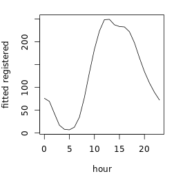

registered, 주말 먼저 진행했고... 맨 먼저 다음과 같은 모형을 가정했다. 

$y = f_{h}(hour)+\epsilon$

설명변수와 반응변수간 어떤 관계가 있는지 추론하기 위해 시간의 효과를 배제한 $y$ 변수와 설명변수들간 관계를 살펴봤다. 시간의 효과를 배제한 count 변수는 다음과 같다.  

$y_{dh} = registered - f_{h}^{\verb!^!}(hour)$

temp는 count에 영향을 줄 때 선형적으로 증가하지 않을 것이다. 기온이 아주 낮거나 아주 높으면 자전거를 빌리는 사람이 없을 것이기 때문이다. 인간이 활동하기 좋은 20도 이상을 고점으로 하는 외로 볼록한 함수의 형태를 띌 것으로 예상된다.

humidity 또한 선형적인 관계를 보이지는 않을것같다. 적정 습도일 때 가장 활발하고 습도가 아주 높거나 낮으면 오히려 반응변수가 작아지는데 영향을 끼칠 것이라 기대된다.

그리고 경험적으로 습도와 온도는 상호작용을 일으킬 것으로 기대된다. 기온이 좀 높아도 습도가 낮으면 쾌적하다고 느낄 수 있으며 상대적으로 습도가 높으면 더 덥게 느껴진다. 이런 이유 때문에 불쾌지수라는 생활 기상 지수를 일상에 참고하기도 한다.
<br>  
<br>  


```
## 
## Family: gaussian 
## Link function: identity 
## 
## Formula:
## y_dh ~ s(temp, humidity, k = 15)
## 
## Parametric coefficients:
##             Estimate Std. Error t value Pr(>|t|)
## (Intercept)  0.09288    0.96321   0.096    0.923
## 
## Approximate significance of smooth terms:
##                    edf Ref.df     F p-value    
## s(temp,humidity) 13.88     14 100.1  <2e-16 ***
## ---
## Signif. codes:  0 '***' 0.001 '**' 0.01 '*' 0.05 '.' 0.1 ' ' 1
## 
## R-sq.(adj) =  0.305   Deviance explained = 30.8%
## GCV = 2948.4  Scale est. = 2934.6    n = 3163
```

```
## Error in loadNamespace(name): there is no package called 'webshot'
```
습하면 이용량이 현저히 떨어지는것을 확인할 수 있다. 더워도 떨어지는 경향이 있는데 기온이 조금 높아도 습도가 낮을때는 이용량이 가장 높은것을 확인할 수 있다. 

불쾌지수(Temperature Humidity Index, THI)는 열과 습도의 영향을 결합하는 지수를 말한다. 불쾌지수는 이슬점을 기반으로 한 무차원 수이다. 불쾌지수를 모방하여 추가할 항은 다음과 같다.
<br>  
$y = f_{h}(hour)+ f_{thi}(temp, humidity) +\epsilon$
<br>  
이런 방식으로 $x,y$ 관계를 살피며 모형에 포함될 항을 추가하였다. 주중, casual도 동일한 방식으로 진행했다.
<br>  
<br>  

## 모형과 해석
#### 1) 잔차 진단과 가중치

```r
model <- as.formula(paste(y, ' ~ 1'))
model <- update(
  model, . ~ s(hour, k=14) + 
    s(temp, humidity, k=10) +
    s(temp, windspeed, k=12) + 
    season2 + weather2
)
noweighted <- gam(
  formula = model,
  family = quasipoisson(),
  data = dat_sub
)
weighted <- gam(
  formula = model,
  family = quasipoisson(),
  weights = 1/sd,
  data = dat_sub
)

par(mfrow = c(1,2))
plot(
  noweighted$linear.predictors, resid(noweighted), 
  xlab = 'linear predictors', ylab = 'residual'
)
plot(
  weighted$linear.predictors, resid(weighted),
  xlab = 'linear predictors', ylab = 'residual'
)
```

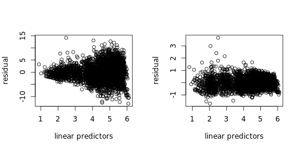

잔차 진단 결과 관측값별로 분산이 일정치 않음을 볼 수 있다. weight를 추가하여 분산을 안정화 시켰다. 분산의 구조는 시간별로 다르다고 가정하고 시간의 1/표준편차를 사용하였다. 따라서 최종 모형의 잔차 진단 그림은 다음과 같다.
<br>  
<br>  


```r
regit_end <- readRDS('/home/sukhyun/project/bike_sharing_demand/model/regit_end.rds')
par(mfrow=c(2,2))
gam.check(regit_end)
```

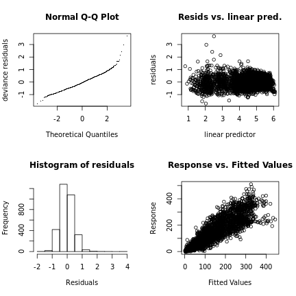

```
## 
## Method: GCV   Optimizer: outer newton
## full convergence after 13 iterations.
## Gradient range [4.214214e-10,2.645693e-07]
## (score 0.20636 & scale 0.2159273).
## Hessian positive definite, eigenvalue range [2.107639e-05,7.771957e-05].
## Model rank =  36 / 36 
## 
## Basis dimension (k) checking results. Low p-value (k-index<1) may
## indicate that k is too low, especially if edf is close to k'.
## 
##                      k'   edf k-index p-value    
## s(hour)           13.00 12.83    0.63  <2e-16 ***
## s(temp,humidity)   9.00  7.45    0.92  <2e-16 ***
## s(temp,windspeed) 10.00  9.43    0.96   0.015 *  
## ---
## Signif. codes:  0 '***' 0.001 '**' 0.01 '*' 0.05 '.' 0.1 ' ' 1
```
꼬리 부분을 제왜하면 Theoretical Quantiles과 일치성이 있다고 볼 수 있다. 이분산성은 weight 추가 통해 완화되었다. 다소 첨도가 높지만 0 주변으로 분포한 잔차를 볼 수 있다.

<br>  
  
#### 2) 모형 해석

```r
plot(regit_end, pages = 1, all.terms = T)
```


gam object를 plot함수에 적용하면 partial residual plot이 나온다. partial residual plot은 모형에 포함된 다른 설명 변수가 주어졌다는 가정하에 한 설명변수와 반응 변수의 관계를 나타내는 그림이다. 다른 설명변수는 연속형의 경우 중위수, 범주형의 경우 최빈값으로 주어진다.

여름과 가을에 큰 차이가 없어서 범주를 합쳤다. 겨울보다 봄에 이용자가 더 적은 경향을 알 수 있다.

날씨의 worst는 표본이 적어 worse와 합쳤고 best, better은 큰 차이가 없어 합쳤다. 예상대로 날씨가 나쁘지 않을 때 더 이용자 많다.
<br>  
<br>  


```r
surface(regit_end, c('temp', 'humidity'), type = 'response')
```

```
## Error in loadNamespace(name): there is no package called 'webshot'
```

기온은 24~27도에서 가장 높은 이용량을 보이고 더 높거나 낮으면 이용자가 낮아지는 경향이 있다. 분석 전에 예측했던 볼록한 함수와 크게 다르지 않다.

습도는 낮을수록 이용량이 증가하는 경향이 있고 약간의 비선형적인 경향이 있다. 아주 낮은 습도보다 25~45에서 이용량이 더 높다.

surface의 굴곡을 보면 상호작은 생각보다 크진 않았지만 있어보인다. surface의 peak 지점은 습도와 적정 습도(25~45), 적정 온도(24~27)인 것을 볼 수 있다.
<br>  
<br>    


```r
surface(regit_end, c('temp', 'windspeed'), type = 'response')
```

```
## Error in loadNamespace(name): there is no package called 'webshot'
```

풍속은 낮을수록 이용자가 많은 경향이 있다. 풍속이 낮아도 기온이 높으면 이용자가 꺾이는 지점을 볼 수 있다.

모형은 총 3개를 적합시켰고 각 예측값을 더한 것을 count변수 예측값으로 사용하였다.
<br>  
<br>  

**모형**

$registered_{weekend} = f_{h|end}(hour) + f_{thi|end}(temp, humidity) + f_{tw|end}(temp, windspeed) + season + weather + \epsilon$

$registered_{weekday} = f_{h|day}(hour) + f_{thi|day}(temp, humidity) + f_{tw|day}(temp, windspeed) + season + weather + \epsilon$

$casual = f_{h|cas}(hour) + f_{thi|cas}(temp, humidity) + f_{tw|cas}(temp, windspeed) + season + weather + weekend + \epsilon$
<br>  
<br>  
**예측값**

$\hat{count} = \hat{registered} + \hat{casual}, \:\:\: \hat{registered} = \hat{registered_{weekend}} + \hat{registered_{weekday}}$
<br>  
<br>  

#### 3) 예측값 시각화
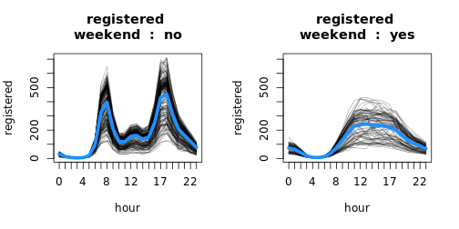
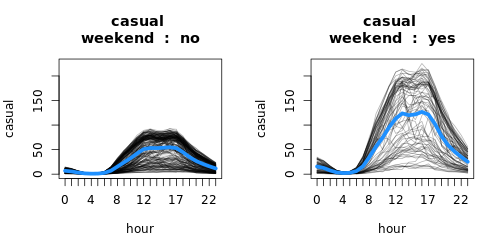
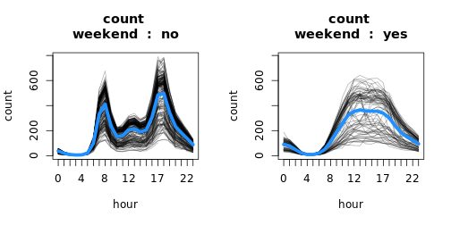
<br>  
<br>  
<br>  

### references

Dobson, Annette J., and Adrian G. Barnett. An introduction to generalized linear models. CRC press, 2018.

Hilbe, Joseph M. Modeling count data. Cambridge University Press, 2014.

Wood, Simon N. Generalized additive models: an introduction with R. CRC press, 2017.

Friedman, Jerome, Trevor Hastie, and Robert Tibshirani. The elements of statistical learning. Vol. 1. No. 10. New York: Springer series in statistics, 2001.

overdispersion에 관한 글 : [link1](https://stats.stackexchange.com/questions/62006/definition-of-dispersion-parameter-for-quasipoisson-family), [link2](https://stats.stackexchange.com/questions/314948/quasi-likelihood-quasi-poisson)
