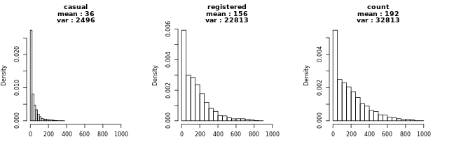
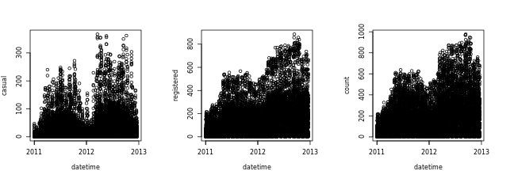
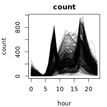
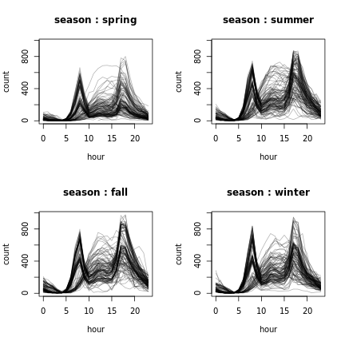
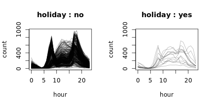
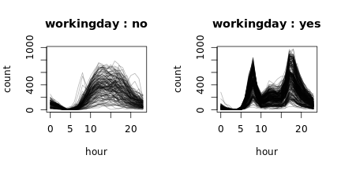

### 1. EDA
#### 1.1 Distribution of y

<br>  
<br>  

#### 1.2 Trend

<br>  
<br>  

#### 1.3 Trend hour







<br>  
<br>  

### 2. overdispersion
#### 2.1 dispersion statistic

```r
form <- count ~ workingday + weather + 
  temp + humidity + windspeed + hour + I(hour^2)
poi_mod <- glm(formula = form, data = data_tr, family = poisson)

pchi2 <- sum(residuals(poi_mod, type = 'pearson')^2)
disp_stat <- pchi2/poi_mod$df.residual
disp_stat
```

```
## [1] 92.83777
```
<br>  
<br>  

#### 2.1 observed vs expected counts

```r
obs_counts <- table(data_tr$count)[1:100]
exp_probs <- sapply(1:100, function(x) dpois(x, poi_mod$fitted.values))
exp_counts <- round(apply(exp_probs, 2, sum))

# table
# rbind(obs_counts, exp_counts)

# plot
plot(1:100, obs_counts, pch = 19, col = 'red', xlab = 'count')
lines(1:100, obs_counts, col = 'red')
points(1:100, exp_counts, pch = 19, col = 'blue')
lines(1:100, exp_counts, col = 'blue')
legend('topright', c('obs', 'exp'), pch=19, col=c('red', 'blue'))
```


